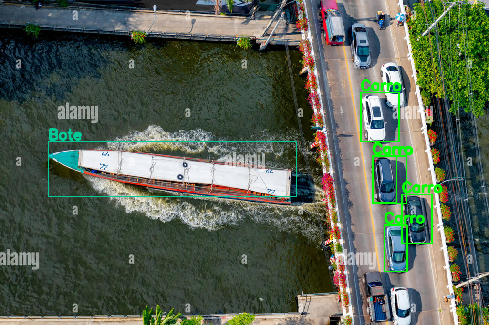

# 🚗 Clasificación y Detección de Vehículos con YOLO



## 📖 Descripción del Proyecto
Este proyecto implementa un sistema de detección y clasificación de vehículos utilizando YOLO (You Only Look Once) y OpenCV en Python. Proporciona una solución avanzada para la detección de vehículos en tiempo real, utilizando técnicas modernas de visión por computadora.

### 🛠 Tecnologías Utilizadas
- Framework: YOLO (You Only Look Once).
- Visión por Computadora: OpenCV (cv2).
- Lenguaje de Programación: Python.
- Librerías:
  - NumPy
  - Matplotlib
  - tkinter
  - PIL (Python Imaging Library)

### 🎯 Características Principales
- Detección de vehículos en tiempo real.
- Identificación de múltiples clases de vehículos.
- Algoritmo optimizado para un rendimiento eficiente.

### 📦 Instalación
**Nota**:  
> El código para el modelo YOLO fue desarrollado en Google Colab. Por lo tanto, este código es útil para la parte de detección en tiempo real. Para usar este código, debes tener tu archivo del modelo YOLO (best.pt) y cargarlo en la variable model_V8n.

```
# Pasos para instalar

# Clona el repositorio
git clone https://github.com/DonLuisM/Vehicles_detection_YOLO.git

# Asegurate de cargar el modelo YOLO (best.pt)
modelo_V8n = YOLO('tu_modelo_YOLO.pt')
```

### 🤝 Contribuciones
Los modelos requieren cambios en hiperparametros o variación en sus épocas. Por lo que, ¡Las contribuciones son bienvenidas!
